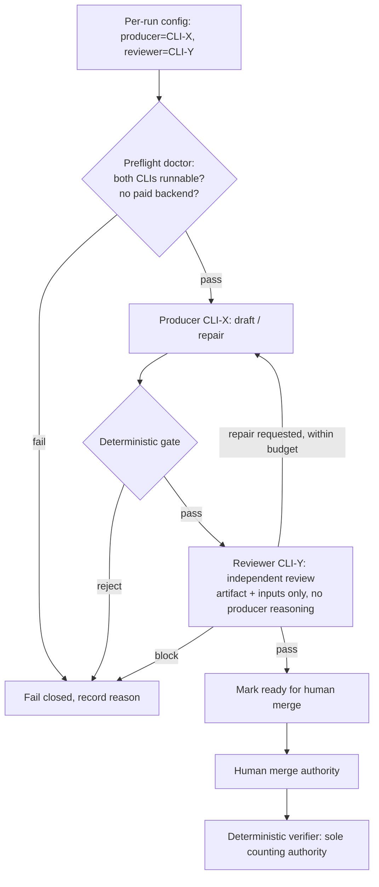

# Arbor Dual-CLI Tandem Role Orchestration Requirements

## Summary

Add a reusable Arbor capability that drives Claude Code and Codex as local CLI agents *in tandem*, assigning each to a role per run — by default a **producer** (drafts and repairs an artifact) and a separate **independent reviewer** bound to the *other* CLI. The CLIs run as opaque role-workers behind a native Arbor subprocess backend, driven by Arbor's autonomous deterministic spine, entirely within the subscription-CLI boundary (no paid provider APIs). Arbor ships only the reusable primitives; the wiki-forge doc-maintainer is the first target, defining its own roles and lifecycle on top. The proving deliverable is a single run that produces one quality wiki-forge docs PR — drafted by one CLI and independently passed by the other.

______________________________________________________________________

## Problem Frame

The wiki-forge doc-maintainer loop has proven cadence and durability but not content *quality*: a stateless, additive-only generator over a synthetic scan corpus cannot revise existing docs, and a model reviewing its own output catches little, so measured quality stayed flat (and once produced a PR documenting a release regime the repo does not have). The open question is whether Arbor can drive a maintainer **autonomously** while raising quality — and the bet is that two genuinely different CLI agents in tandem, one producing and the *other* independently reviewing, catches what single-model self-review cannot.

Arbor cannot do this today. Its native autonomous runtime invokes models in-process over HTTP APIs, and for Claude that routes to the paid Anthropic API — outside the operator's no-paid-API boundary. The only subscription-CLI path is `arbor local`, a standalone one-shot launcher that runs a single CLI (`claude` *or* `codex`), has no role concept, runs nothing in tandem, and is explicitly disjoint from the native runtime, config, session state, and checkpoint/resume machinery. So "Arbor orchestrates both CLIs in tandem with per-run roles, autonomously, inside the boundary" is net-new work — not a configuration of what already exists.

This capability is framed as a reusable Arbor feature with wiki-forge as the first proving target. It supersedes the wiki-forge maintainer requirements on two axes — the orchestrator (Arbor, not a native wiki-forge supervisor) and the model actor (Claude Code **and** Codex in tandem, not Codex as the sole interface) — while preserving that target's safety boundaries.

______________________________________________________________________

## Key Decisions

- **CLIs as native subprocess backends.** Claude Code and Codex become role-workers invoked through a native Arbor backend so Arbor's own autonomous loop, session state, and checkpoints drive them. Not the standalone `arbor local` launcher (which is disjoint from the autonomy) and not per-turn HTTP providers (which the CLIs, being full agents, do not fit). This keeps the run inside the subscription-CLI boundary because nothing touches the paid API.
- **A role is a delegated task, not a driven turn.** The orchestrator hands a CLI a role-task; the CLI runs its own agent loop to completion and returns a finished result. This matches what Claude Code and Codex actually are (agents, not raw model endpoints).
- **Minimal tandem: producer + independent reviewer, on different CLIs by default.** The reusable role set is a producer (draft + repair) and an independent reviewer. The reviewer defaults to a *different* CLI than the producer, which turns "independence" from a same-model promise into genuine cross-model independence — the mechanism by which the tandem raises quality.
- **Deterministic orchestration spine.** The orchestration brain runs without a coordinator model call; all model-like work is performed by the CLI role-workers. This keeps the spine's provider surface at zero. (A target that later needs adaptive orchestration must use a local, non-paid model — out of scope here.)
- **Arbor ships primitives only.** Arbor owns the CLI-subprocess backend, role→CLI binding and per-run config, the cross-CLI independence default, per-CLI observability/cost-attribution, and the fail-closed fallback/preflight. The concrete role taxonomy beyond producer/reviewer and the whole maintainer lifecycle live in the target.
- **Fail closed on an unavailable CLI.** If a role's assigned CLI is missing or dies, the run stops with a clear reason. It never silently substitutes — because a silent swap could collapse producer and reviewer onto one CLI and quietly defeat the independence that is the entire point.
- **Authority order unchanged.** Deterministic gate → model review → human → verifier. A CLI's review verdict can block readiness or request repair, but cannot mark work done and cannot override a deterministic gate or the verifier.
- **Supersede wiki-forge on orchestrator and actor; preserve its boundaries.** The wiki-forge maintainer requirements are the target spec, carried in. Their Codex-as-sole-interface and native-supervisor decisions are superseded here; their deterministic-gate / additive-only-counting / untrusted-input / human-merge-authority / no-CI-in-v1 boundaries are preserved as target constraints.
- **MVP is a feasibility proof.** The first deliverable is one autonomous run producing a single quality, independently-reviewed wiki-forge docs PR. Breadth (full lifecycle, richer roles, more targets) waits until the bet proves worth the effort.

______________________________________________________________________

## Actors

- A1. **Operator.** Configures the run (including role→CLI binding), launches it, and holds merge authority over any resulting PR.
- A2. **Arbor orchestration spine.** Deterministic; sequences role-task delegations, enforces the deterministic gates, records run state and observability, and fails closed on boundary or availability violations.
- A3. **Producer CLI.** The CLI bound to the producer role for this run; drafts and repairs the artifact, running its own agent loop to completion.
- A4. **Reviewer CLI.** The CLI bound to the reviewer role; by default a different CLI than A3. Performs the independent review pass that gates readiness.
- A5. **Target maintainer definition (wiki-forge).** Supplies the concrete role-task content, the deterministic gates, and the lifecycle. Lives in the target, not in Arbor.

______________________________________________________________________

## Requirements

R1–R3 are the CLI backend and provider boundary. R4–R7 are the role model and per-run assignment. R8–R9 are independence and gating authority. R10–R11 are observability and state. R12–R13 are fallback and preflight. R14–R16 are the reusable-capability boundary. R17–R18 are the MVP proving run.

**CLI backend and provider boundary**

- R1. Arbor must provide a subprocess-CLI backend that runs Claude Code and Codex as local CLI agents — each executing its own loop to completion and returning a result — selectable as native backends inside the autonomous runtime, distinct from both the standalone `arbor local` launcher and the in-process HTTP/API providers.
- R2. CLI-backed work must use only subscription/metered local CLIs and must never call a paid provider API, provider SDK, provider GitHub Action, or MCP/provider tool. The run must fail closed if a configured backend would resolve to a paid API (for example `provider: auto` resolving a `claude*` model to the hosted Anthropic API).
- R3. The orchestration spine must operate deterministically, with no coordinator model call; all model-like work must be performed by the CLI role-workers, so the spine itself has no provider/model surface.

**Role model and per-run assignment**

- R4. A role must be modeled as a discrete delegated task the spine hands to a CLI worker, not as a turn the spine drives; the worker runs autonomously and returns a result artifact.
- R5. The reusable role primitive must support at least a producer role (produce and repair an artifact) and an independent reviewer role (assess the producer's output), each independently bindable to a specific CLI for a run.
- R6. Role→CLI binding must be expressed in per-run configuration that layers on Arbor's existing precedence (built-in defaults < project/run config < CLI-flag override); a run declares which CLI fills each role.
- R7. The reviewer must default to a different CLI than the producer (cross-model independence). The binding may be overridden, but the producer and reviewer must never resolve to the same CLI silently (see R12).

**Independence and gating authority**

- R8. The reviewer's pass must be a genuinely separate invocation from the producer's: a separate process with no shared scratch state, grounded only in the deterministic artifact and the task inputs, and not given the producer's own reasoning or justification trace — so the cross-model independence is real, not nominal.
- R9. Neither CLI's verdict may be a counting or merge authority. The deterministic gates remain authoritative; a model verdict may block readiness or request a repair pass but may not mark work done and may not override a deterministic gate or the verifier. The authority order is deterministic gate → model review → human → verifier.

**Observability, cost, and state**

- R10. Each run must record, per role-task, which CLI performed it, the invocation counts, and budget/cost attribution per CLI, in durable run state — reusing Arbor's session-state and redacted-snapshot conventions, with no credentials or token-bearing CLI output persisted.
- R11. Run state must be durable and resumable through the run lifecycle using Arbor's existing session and checkpoint machinery, with stable join keys tying each role-task to its CLI, its inputs, and its result artifact.

**Fallback and preflight**

- R12. If a role's assigned CLI is unavailable — caught at preflight or by mid-run failure — the run must fail closed with a clear reason. It must never silently substitute another CLI and must never collapse producer and reviewer onto the same CLI.
- R13. A preflight doctor must verify that each configured role's CLI is present and runnable (extending Arbor's existing `arbor local` CLI probes) before any role-task work begins; a failed preflight is a hard stop.

**Reusable-capability boundary**

- R14. Arbor must ship only the reusable primitives: the CLI-subprocess backend (R1), role→CLI binding and per-run config (R5–R6), the cross-CLI independence default (R7), per-CLI observability/cost-attribution (R10), and the fail-closed fallback and preflight (R12–R13).
- R15. The concrete role taxonomy beyond producer/reviewer, the maintainer lifecycle (companion PRs, coverage scanning, the deterministic doc gates, the dogfood verifier), and all target-specific actions must live in the target (the wiki-forge repo or an Arbor example package), not in Arbor's core.
- R16. When the capability is used against wiki-forge, it must preserve that target's existing constraints: the deterministic additive-only gate as the dogfood-counting authority, untrusted-source-input handling, human merge authority, and no CI in the first version. These are carried target constraints, not Arbor primitives.

**MVP / proving run**

- R17. The first deliverable must be a single autonomous Arbor run against wiki-forge that produces one quality docs PR: drafted by the producer CLI and independently passed by the reviewer CLI (a different CLI), with wiki-forge's deterministic gates green, entirely within the subscription-CLI boundary.
- R18. "Quality" for the proving run is defined as the different-CLI independent review passing **and** wiki-forge's existing deterministic gates passing. No separate factual or quality gate is introduced for the MVP.

______________________________________________________________________

## Key Flows

- F1. **Proving run — produce, gate, independently review, ready**

  - **Trigger:** The operator launches a run with a producer CLI and a (different) reviewer CLI bound.
  - **Actors:** A1, A2, A3, A4, A5
  - **Steps:** The spine runs preflight (R13); delegates the produce task to the producer CLI (A3), which returns a draft artifact; runs the target's deterministic gate; delegates an independent review of the gated artifact to the reviewer CLI (A4), which receives only the artifact and task inputs (R8); on a review-requested repair, loops back to the producer within budget; marks the artifact ready only after the deterministic gate and the independent review both pass.
  - **Outcome:** A ready, independently-reviewed artifact (for wiki-forge, a docs PR) handed to the human for merge; or a recorded stop with reason.
  - **Covered by:** R1, R3, R4, R5, R7, R8, R9, R13, R17, R18

- F2. **Fail-closed on CLI availability**

  - **Trigger:** A configured role's CLI is absent at preflight, would resolve to a paid backend, or dies mid-run.
  - **Actors:** A1, A2
  - **Steps:** Preflight detects the missing/paid backend and hard-stops before any work; or a mid-run failure stops the current role-task. The spine records the reason and never substitutes a CLI or collapses the two roles onto one CLI.
  - **Outcome:** The run stops with an operator-readable reason; no degraded or independence-collapsed output is produced.
  - **Covered by:** R2, R12, R13

______________________________________________________________________

## High-Level Shape

The proving run's role tandem and the carried authority order:

Authority order is left-to-right in precedence: the deterministic gate and verifier bound what is allowed and what counts; the model review can only block or request repair within those bounds; the human decides the merge.

______________________________________________________________________

## Acceptance Examples

- AE1. **Covers R17, R18, R7, R8.**

  - **Given:** A run is configured with the producer on one CLI and the reviewer on a different CLI against wiki-forge.
  - **When:** The producer drafts a docs change, the deterministic gate passes, and the reviewer CLI independently reviews the gated artifact.
  - **Then:** The artifact is marked ready as a docs PR only after both the deterministic gate and the different-CLI review pass, and the run did so without any paid-API call.

- AE2. **Covers R12, R13.**

  - **Given:** The CLI bound to the reviewer role is not installed or not runnable.
  - **When:** The run starts (or the reviewer CLI dies mid-run).
  - **Then:** Preflight (or the mid-run handler) fails closed with a clear reason and performs no silent substitution; the producer's CLI is never reused as the reviewer.

- AE3. **Covers R2, R3.**

  - **Given:** A configuration whose backend would resolve a role to a paid provider API (for example `provider: auto` with a `claude*` model and no local endpoint).
  - **When:** The run evaluates that configuration at preflight.
  - **Then:** The run fails closed rather than calling the paid API, and the deterministic spine itself makes no model call.

- AE4. **Covers R8, R9.**

  - **Given:** A produced artifact and its producer's reasoning trace.
  - **When:** The reviewer role runs.
  - **Then:** The reviewer receives only the deterministic artifact and task inputs (not the producer's reasoning), and its verdict can request repair or block readiness but cannot mark the work done or override the deterministic gate or verifier.

______________________________________________________________________

## Success Criteria

- A single autonomous Arbor run produces one quality wiki-forge docs PR, drafted by one CLI and independently passed by a different CLI, with the deterministic gates green.
- Producer and reviewer roles can be bound to specific CLIs per run, and the reviewer is a different CLI than the producer by default.
- No run performs a paid provider API, SDK, provider GitHub Action, or MCP/provider call; an attempted paid path fails closed.
- An unavailable role CLI fails the run closed with an operator-readable reason and never collapses producer and reviewer onto one CLI.
- Per-CLI usage and cost attribution for the run are recorded in durable, redaction-safe run state.
- The wiki-forge target's deterministic additive-only counting, untrusted-input handling, human merge authority, and no-CI boundary are intact when the capability runs against it.

______________________________________________________________________

## Scope Boundaries

**Deferred for later**

- The full wiki-forge maintainer lifecycle (PR poller, companion-PR lifecycle reconciliation, catch-up overflow handling, quarantine) — the MVP proves the tandem on a single docs PR, not the whole maintainer.
- A richer per-run role set beyond producer + reviewer (separately bindable impact-assessor, repair, summarize) — added only if the bet proves worth it.
- Targets other than wiki-forge — the reusable primitives are designed to generalize, but only wiki-forge is exercised in the MVP.
- Adaptive, model-driven orchestration (a coordinator model deciding the flow) — the spine is deterministic for v1; any later adaptive orchestration must use a local, non-paid model.

**Outside this capability's identity**

- A native-HTTP/paid-API path for Claude or Codex role-work — the capability is subscription-CLI-only by definition.
- Arbor owning the maintainer lifecycle or gate orchestration (the "thick Arbor" shape) — Arbor stays primitives-only; targets own roles and lifecycle.
- Replacing or relaxing wiki-forge's deterministic dogfood verifier or additive-only counting — that authority is preserved unchanged.

______________________________________________________________________

## Dependencies and Assumptions

- The Arbor repo is checked out locally (canonical WSL/Linux clone); the local-CLI work is on the `codex/wsl-local-cli-adaptation` branch.
- Both `claude` (Claude Code) and `codex` CLIs are installed, authenticated as subscription/metered CLIs, and on PATH for the run host.
- The wiki-forge maintainer requirements (wiki-forge repo: `docs/brainstorms/2026-06-22-autonomous-doc-maintainer-requirements.md`) are the target spec; they require a reconciling update to reflect Arbor-orchestrated dual-CLI roles (see Outstanding Questions).
- The deterministic gates and verifier the proving run relies on are the target's, supplied by wiki-forge.
- Any non-CLI model the spine might use is out of scope for v1 (the spine is deterministic); should one ever be needed, it must be a local, non-paid endpoint.

______________________________________________________________________

## Outstanding Questions

**Deferred to planning**

- The exact CLI invocation contract per role (command shape, working-directory and permission flags, how a role-task prompt and inputs are passed, how a structured result/diff is captured) — to be made equivalent at the prompt-contract level across Claude Code and Codex.
- The per-run config field shapes for role→CLI binding and how they slot into Arbor's existing config precedence and snapshot/redaction.
- The observability/cost-attribution record shape (what per-CLI fields, where in session state, how surfaced to the operator).
- How the target's producer role maps onto wiki-forge's draft + repair behavior, and how the reviewer role consumes wiki-forge's deterministic artifact for the independent pass.
- Whether the MVP proving run targets a catch-up-style docs PR or a single companion-style docs PR for the first proof.

**Resolve before planning**

- Reconciling the wiki-forge maintainer requirements doc to this capability (supersede the Codex-only and native-supervisor decisions; keep the preserved boundaries). This is a cross-repo coherence task that should be settled before the wiki-forge target slices are planned.

______________________________________________________________________

## Sources

Paths are repo-relative to the Arbor repo unless prefixed with "wiki-forge repo:".

- `src/cli/commands/local_cmd.py` — the existing standalone `arbor local` launcher (single CLI per invocation; the prior art the native backend supersedes).
- `src/core/__init__.py`, `src/core/llm/` — the provider factory and HTTP/API provider layer the CLI-subprocess backend sits alongside.
- `src/core/config_resolve.py`, `src/core/config_schema.py` — config precedence and the typed-config + redacted-snapshot conventions the per-run role config and observability extend.
- `docs/plans/2026-06-20-001-feat-wiki-forge-maintainer-arbor-run-plan.md` — prior run-plan: authority hierarchy, provider:auto fail-closed-on-paid, lifecycle state machine, parse-verifier-by-verdict-not-exit-code, `.arbor/sessions/<run_name>/` durable state. Treats the two CLIs as interchangeable alternatives run one at a time, not in tandem.
- `docs/arbor-interface.md` — documents that `arbor local` is separate from the native runtime.
- wiki-forge repo: `docs/brainstorms/2026-06-22-autonomous-doc-maintainer-requirements.md` — the target maintainer spec (R1–R40), carried in and superseded on the orchestrator and actor axes.
- wiki-forge repo: `docs/goals/C2-doc-maintainer-write-loop.md` — the C2 quality-flat finding that motivates the cross-model-independence bet.
