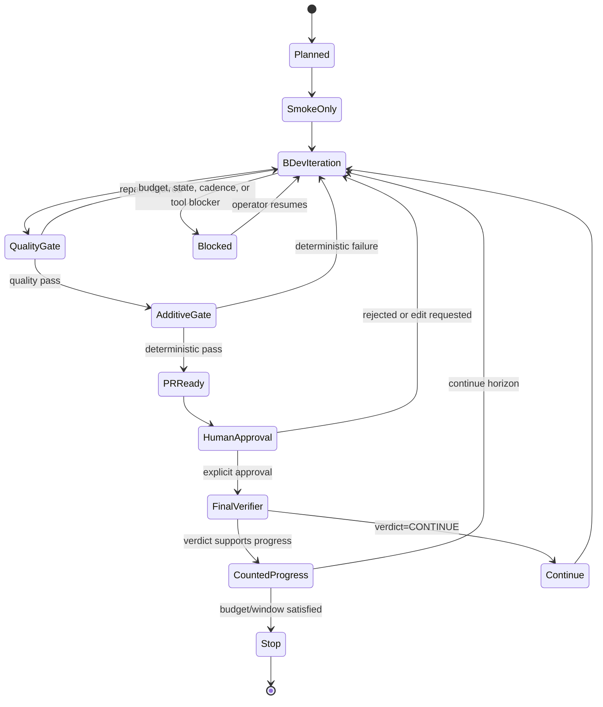
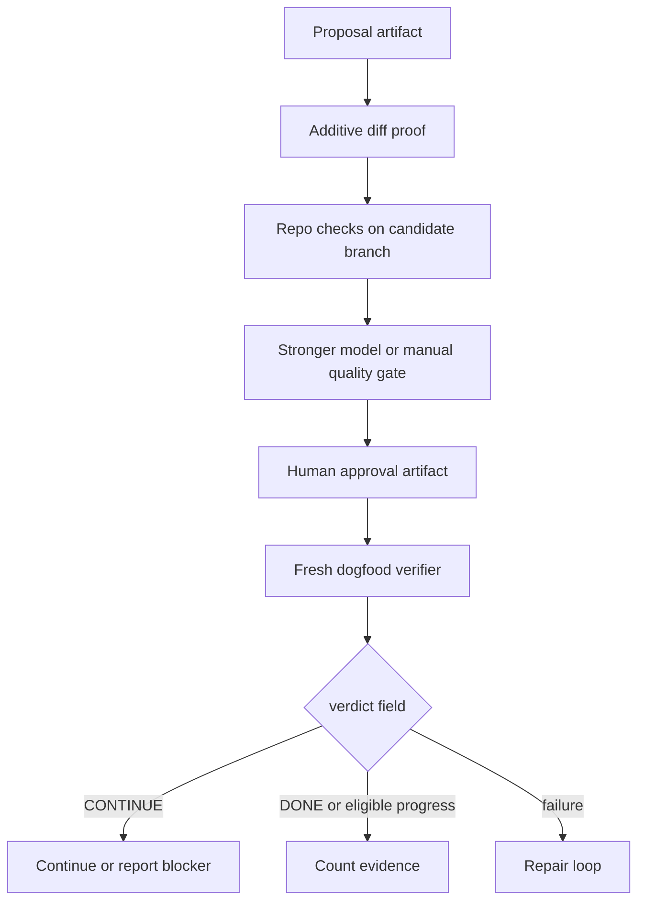

# feat: Wiki-forge doc-maintainer Arbor run

## Summary

This plan adds an Arbor execution package for a long-running `wiki-forge` doc-maintainer study. The package favors `arbor local` with Claude Code or Codex CLI, keeps native provider-backed Arbor runs behind explicit permission, and defines the gate hierarchy that prevents model claims from replacing the repo's deterministic dogfood verifier.

The run is not just a local LLM docs maintainer. It is a guarded operating loop: propose, repair, re-check, escalate for model review, require human approval, and count only verifier-backed evidence.

---

## Problem Frame

`wiki-forge` already has a doc-maintainer substrate: proposal generation, additive proof, approval artifacts, and a read-only dogfood verifier. The missing piece for an Arbor stress run is an operating contract that turns that substrate into a long-horizon, self-healing test of Arbor coordination without contaminating `main`, using final verifier output as the only counting authority.

Arbor has two relevant surfaces. The native runtime provides full coordinator, executor worktree, Idea Tree, checkpoint, Web UI, and report behavior, but it can call configured LLM providers. The WSL local adapter runs the Arbor skill suite through installed `claude` or `codex` CLIs without using Arbor provider setup. The execution package must account for both while failing closed on paid/provider use.

---

## Requirements

**Execution Package**

- R1. Provide a reusable Arbor example package for the `wiki-forge` doc-maintainer run that an operator can execute from the Arbor checkout.
- R2. Account for both Claude Code CLI and Codex CLI in the local-adapter path.
- R3. Keep the native provider-backed path documented as optional and permission-bound, with a local-endpoint template rather than `provider: auto`.
- R4. Preserve Arbor's convention that live run evidence belongs in the target repo under `.arbor/sessions/<run_name>/`.

**Guardrails**

- R5. Treat planning as read-only for `wiki-forge`; execution writes only through isolated branches or worktrees.
- R6. Require explicit operator approval before package installs, downloads, long jobs, GPU/training, final verifier use, PR creation, merge attempts, or `B_test`-like evidence use.
- R7. Fail closed when provider/API mode is ambiguous, especially when `provider: auto` plus a Claude model could resolve to native Anthropic.
- R8. Require human approval as a hard state transition, never as an interaction-mode timeout.

**Maintainer Loop**

- R9. Define a self-improving loop where rejected proposals, gate findings, and reviewer feedback are fed into the next proposal cycle.
- R10. Define a self-healing loop for stale branches, partial artifacts, failed checks, missed cadence windows, corrupted state, and interrupted sessions.
- R11. Keep the stronger model quality gate as a merge-eligibility input, not a counting authority.

**Evidence And Verification**

- R12. Map Arbor `B_dev` to offline/dev iteration signals and map `B_test` to fresh dogfood verifier output plus operator checkpoint.
- R13. Parse dogfood verifier output by `verdict=...`; never treat process exit code alone as a passing result.
- R14. Preserve session artifacts, Idea Tree state, proposal artifacts, review reports, approval records, and verifier snapshots.

---

## Assumptions

- The target repository is `wiki-forge`. Paths that name target files, such as `scripts/verify_maintainer_dogfood.py`, are target-repo-relative.
- The Arbor execution package is stored in this repo under `examples/wiki_forge_doc_maintainer/`.
- Real `wiki-forge` modification, provider-backed native runs, final verifier use, PR creation, and merges remain outside this planning step.
- The default stronger-review implementation is a local or manually operated reviewer. Paid Anthropic/OpenAI review is disabled until the operator grants current-turn permission and the agent states provider, model, and scope.

---

## Key Technical Decisions

- KTD1. **Use `arbor local` as the default run interface:** It exercises the Arbor skill suite through Claude Code or Codex CLI while avoiding Arbor's native provider client construction.
- KTD2. **Keep native Arbor as an explicit local-endpoint or permissioned path:** Native runtime is valuable for full checkpoints, Web UI, and reports, but ambiguous provider config can consume paid API credits.
- KTD3. **Treat the dogfood verifier as final authority:** Model review can block or require repair, but only fresh `MAINTAINER-DOGFOOD` output and the operator checkpoint can establish final run progress.
- KTD4. **Separate quality gates by authority level:** Deterministic additive/repo checks run before model review; model review runs before human approval; final verifier runs after human approval.
- KTD5. **Represent the run as a lifecycle state machine:** A long run needs explicit terminal states for repair, blocked, continue, stop, and merge-ready conditions so resume does not rely on transcript memory.
- KTD6. **Use target-repo session artifacts for durable memory:** `.arbor/sessions/<run_name>/` is the source of truth for run state; summaries and reports are secondary.
- KTD7. **Use branch/proposal IDs as durable join keys:** Proposal ID, branch name, approval file, reviewer report, PR URL, and verifier snapshot must be traceable across the run.
- KTD8. **Re-run repo gates after any delegated Claude/Codex work:** CLI parity is useful, but each agent may produce different local side effects. The repo gates, not agent identity, establish eligibility.

---

## High-Level Technical Design

### Run Lifecycle



### Gate Hierarchy



The model quality gate is intentionally below deterministic checks and above human approval. It can reject, block, or request repair. It cannot mark the long-run goal done and cannot override the dogfood verifier.

---

## Output Structure

```text
docs/
  plans/
    2026-06-20-001-feat-wiki-forge-maintainer-arbor-run-plan.md
examples/
  wiki_forge_doc_maintainer/
    README.md
    quality_gate_contract.md
    research_config.native-local-template.yaml
    task.local.md
    verifier_checklist.md
```

---

## Implementation Units

### U1. Add The Arbor Run Package

- **Goal:** Create a discoverable example package for the `wiki-forge` doc-maintainer run.
- **Requirements:** R1, R4, R14.
- **Dependencies:** None.
- **Files:** `examples/wiki_forge_doc_maintainer/README.md`, `examples/wiki_forge_doc_maintainer/task.local.md`, `examples/wiki_forge_doc_maintainer/research_config.native-local-template.yaml`.
- **Approach:** Follow the existing example-package pattern under `examples/algotune_knn/`, but make this a runbook and template package rather than a runnable benchmark copy.
- **Patterns to follow:** `examples/algotune_knn/README.md`, `examples/research_config.example.yaml`.
- **Test scenarios:** Test expectation: none - documentation and configuration templates only.
- **Verification:** The example package has no automatic native provider path, gives both local-agent paths, and directs durable evidence to the target repo session directory.

### U2. Define Local Claude And Codex Launch Contracts

- **Goal:** Make Claude Code and Codex CLI execution equivalent at the prompt-contract level.
- **Requirements:** R2, R5, R6, R8, R14.
- **Dependencies:** U1.
- **Files:** `examples/wiki_forge_doc_maintainer/README.md`, `examples/wiki_forge_doc_maintainer/task.local.md`.
- **Approach:** Use the same task prompt for both agents through `arbor local run`, with agent-specific command examples only in the runbook. The prompt must say that planning and smoke checks are read-only until the operator grants write scope.
- **Patterns to follow:** `src/cli/commands/local_cmd.py`, `skills/arbor-research-agent/SKILL.md`.
- **Test scenarios:**
  - Local dry-run path: when an operator asks for a dry run, the generated command targets the selected local CLI and does not launch native Arbor provider setup.
  - Agent parity path: when switching `--agent claude` to `--agent codex`, the task prompt keeps the same target, guardrails, state machine, and verifier contract.
  - Approval path: when a proposed action would edit `wiki-forge`, use final verifier, or merge, the prompt requires an explicit operator stop.
- **Verification:** `arbor local doctor` reports both CLIs and the README examples remain dry-run-first.

### U3. Encode The Maintainer Lifecycle

- **Goal:** Define the proposal, repair, approval, verifier, and resume states for the long-running loop.
- **Requirements:** R9, R10, R12, R14.
- **Dependencies:** U1.
- **Files:** `examples/wiki_forge_doc_maintainer/task.local.md`, `examples/wiki_forge_doc_maintainer/verifier_checklist.md`.
- **Approach:** Treat each proposal as a stateful artifact that moves through deterministic gates, model review, human approval, and final verifier. Feed every rejection and repair note into the next iteration.
- **Patterns to follow:** `skills/arbor-agent-orchestrator/SKILL.md`, `skills/arbor-agent-resume-report/SKILL.md`, `docs/outputs-and-resume.md`.
- **Test scenarios:**
  - Interrupted session: when a run stops after proposals exist but before human approval, resume from `.arbor/sessions/<run_name>/` and continue from the last durable state.
  - Failed quality gate: when review returns `repair`, the proposal is not PR-ready and its findings become next-cycle context.
  - Stale branch: when a proposal branch no longer applies, the run records a terminal repair/blocker state instead of force-rewriting main.
  - Missed cadence: when the 21-45 day window or checkpoint window cannot be satisfied, the run reports a blocker instead of fabricating timing evidence.
- **Verification:** The prompt and checklist distinguish `continue`, `repair`, `blocked`, `human_approved`, `final_verifier`, and `counted_progress` states.

### U4. Define The Stronger Quality Gate Contract

- **Goal:** Specify what the stronger model or manual reviewer can and cannot decide.
- **Requirements:** R7, R8, R11, R12, R14.
- **Dependencies:** U1, U3.
- **Files:** `examples/wiki_forge_doc_maintainer/quality_gate_contract.md`, `examples/wiki_forge_doc_maintainer/task.local.md`.
- **Approach:** Make the reviewer gate structured and blocking before human approval, but subordinate it to the dogfood verifier. The default reviewer runtime is local or manual; paid model review is permission-bound.
- **Patterns to follow:** `docs/configuration.md`, `src/core/config_schema.py`, `docs/arbor-interface.md`.
- **Test scenarios:**
  - Paid boundary: when the reviewer runtime is unspecified or would use Anthropic/OpenAI, the gate is `blocked` until explicit current-turn approval exists.
  - Fake-verifier prevention: when the model says the run is done, the checklist still requires dogfood verifier output and ignores the model claim as counting evidence.
  - Repair path: when the reviewer finds unsupported claims or unsafe edits, the proposal returns to iteration with repair notes.
  - Timeout path: when human approval is missing, the state remains waiting for human approval and does not auto-approve.
- **Verification:** The quality contract states output fields, authority limits, paid-provider constraints, and the rule that verifier output is parsed by verdict text.

### U5. Add The Verifier And Human Approval Checklist

- **Goal:** Give the operator a concrete gate checklist for final eligibility.
- **Requirements:** R6, R8, R11, R12, R13, R14.
- **Dependencies:** U3, U4.
- **Files:** `examples/wiki_forge_doc_maintainer/verifier_checklist.md`.
- **Approach:** Make final eligibility a two-step process: explicit approval artifact first, fresh dogfood verifier second. The checklist names offline and online modes and warns that exit code is not the verdict.
- **Patterns to follow:** `docs/outputs-and-resume.md`, `scripts/verify_maintainer_dogfood.py` in the target repo.
- **Test scenarios:**
  - `verdict=CONTINUE`: when the verifier exits 0 but prints `CONTINUE`, the run continues or reports a blocker rather than declaring success.
  - `verify=unchecked`: when the verifier has not run repo verification, the run records the limitation and does not treat it as final merge proof.
  - Approval missing: when no operator approval artifact exists, final verifier and merge remain blocked.
  - Offline injection: when using offline PR metadata, the run labels the evidence as offline and does not misrepresent it as fresh server state.
- **Verification:** The checklist includes preflight, B_dev, merge-eligibility, human approval, final verifier, and post-verifier branches.

### U6. Defer Executable Helper Scripts Until After Plan Acceptance

- **Goal:** Keep this planning package useful without crossing into runtime implementation during planning.
- **Requirements:** R1, R6, R7, R13.
- **Dependencies:** U1, U5.
- **Files:** Deferred: `examples/wiki_forge_doc_maintainer/check_local_prereqs.sh`, `examples/wiki_forge_doc_maintainer/parse_dogfood_verdict.py`.
- **Approach:** If a later implementation pass wants executable helpers, add scripts that only perform local preflight and verifier-output parsing. They must not launch agents, call providers, create PRs, or merge.
- **Patterns to follow:** `examples/algotune_knn/eval.sh` for small example-local helpers; `docs/arbor-interface.md` for no-provider verification boundaries.
- **Test scenarios:**
  - Preflight helper: when run outside WSL or against a `/mnt` path, it fails closed.
  - Verdict parser: when input contains exit code 0 with `verdict=CONTINUE`, it returns a non-success eligibility result.
  - Provider guard: when native config uses `provider: auto`, it reports blocked for this run package.
- **Verification:** Scripts remain absent from this plan package until a code implementation pass is explicitly requested.

---

## Scope Boundaries

- This plan does not run Arbor, Claude Code, Codex CLI, native provider clients, or the long experiment.
- This plan does not modify `wiki-forge`, create PRs, merge branches, run final dogfood evaluation, or call paid APIs.
- This plan does not decide the final stronger model. The default is local/manual review; paid model review is opt-in per current turn.
- This plan does not replace the `wiki-forge` verifier or approval protocol.

### Deferred to Follow-Up Work

- Add executable helper scripts for local preflight and verdict parsing.
- Add an Arbor plugin profile for doc-maintainer studies if this package is reused beyond `wiki-forge`.
- Add a project skill under `.arbor/skills/` in the target repo if repeated runs show the prompt needs more specialized proposal-repair behavior.

---

## System-Wide Impact

This package affects Arbor's examples/docs surface rather than runtime code. The operational impact is larger than the diff: it defines how an external target repo can be used as a long-running Arbor stress test while preserving target-repo evidence, B_dev/B_test separation, local-agent parity, and provider-use boundaries.

The plan also codifies an authority hierarchy that future run packages can reuse: deterministic gates first, reviewer gate second, human approval third, verifier authority last.

---

## Risks And Dependencies

- **Provider leakage:** Native Arbor defaults can resolve to hosted providers. Mitigation: make `arbor local` default and make native config local-endpoint-first.
- **Fake verification:** Model review can sound authoritative. Mitigation: only dogfood verifier output counts.
- **Timeout auto-approval:** Review interaction modes can time out. Mitigation: final approval is an artifact/state transition, not a timeout result.
- **Verifier exit-code trap:** The dogfood verifier can exit 0 for `CONTINUE`. Mitigation: parse `verdict=...`.
- **Long-run drift:** Cadence windows and mid-window checkpoints can be missed. Mitigation: represent missed cadence as blocker/continue, not as success.
- **Agent parity drift:** Claude Code and Codex may produce different local changes. Mitigation: rerun deterministic gates after either agent path.

---

## Documentation And Operational Notes

- Add the run package under `examples/wiki_forge_doc_maintainer/`; do not add it to `mkdocs.yml` unless the project wants this experimental package in public docs navigation.
- Use `mkdocs build` to catch Markdown rendering issues when public docs are affected.
- Use YAML parsing on the native-local config template, but do not run native `arbor run` without provider permission.
- Use `arbor local doctor` for local adapter validation. It checks WSL paths plus Claude Code and Codex CLI availability without launching a run.

---

## Sources And Research

- `AGENTS.md` and `CLAUDE.md` define Arbor's local guardrails, WSL path constraints, and no-provider-call policy for this checkout.
- `docs/arbor-interface.md` distinguishes native runtime from `arbor local` and documents safe no-provider verification surfaces.
- `docs/outputs-and-resume.md` documents `.arbor/sessions/<run_name>/`, config snapshots, reports, branches, and resume behavior.
- `docs/configuration.md` and `src/core/config_schema.py` show why `provider: auto` is unsafe for this package's default path.
- `src/cli/commands/local_cmd.py` defines the local adapter prompt contract and supported agents.
- `skills/arbor-research-agent/SKILL.md` and `skills/arbor-agent-orchestrator/SKILL.md` define intake, Idea Tree, B_dev/B_test, worktree, merge, and evidence invariants.
- `examples/algotune_knn/README.md` and `examples/algotune_knn/research_config.yaml` provide the example-package convention this plan follows.
- Target repo references: `scripts/verify_maintainer_dogfood.py`, `docs/maintainer-dogfood/README.md`, and `docs/goals/C2-doc-maintainer-write-loop.md` define the dogfood verifier, operator approval, and long-window evidence constraints.
